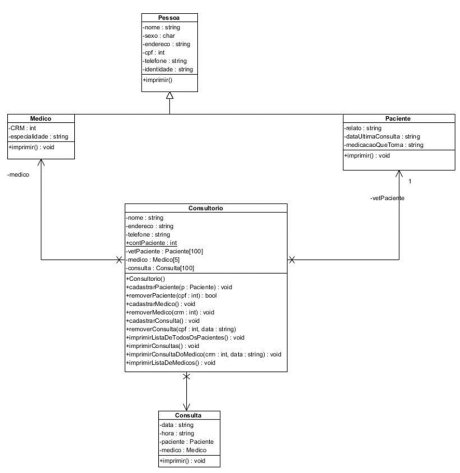
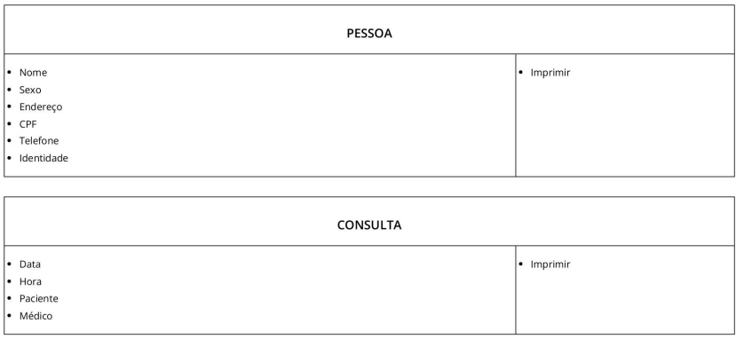
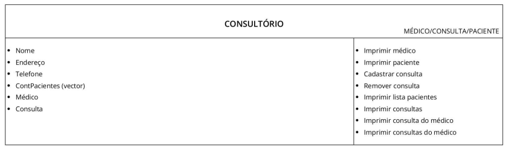

<div id="top"></div>

# TP

> Nosso TP é uma abstração de sistema de hospital,gerência de cadastros, remoção e leitura de informações das classes envolvidas (consulta, médico e paciente). Grande parte das ações ocorrem no consulório, classe responsável neste controle de ações do código. Logo, o trabalho baseou-se em um sistema de gestão hospitalar básico para o auxílio de dados pessoais e gerais de uma clínica.

[![Contributors][contributors-shield]][contributors-url]
[![Tamanho][tamanho-shield]][tamanho-url]
[![Linguagens][linguagens-shield]][linguagens-url]
[![Forks][forks-shield]][forks-url]
[![Stargazers][stars-shield]][stars-url]
[![Issues][issues-shield]][issues-url]
[![MIT License][license-shield]][license-url]

<br/>


## Começando 🚀

> [![Documentação Doxygen][documentacao-shield]][documentacao-url]

Para começar a utilizar o repositório, você precisa cumprir todos os requisitos abaixo:

### Pré-requisitos

* Ter um compilador c++ instalado.
* Ter o mingw na versão 11.2.0 e/ou c++ na versão 17 ou superior.
* Ter o cmake instalado.
* Ter o git instalado.
* Estar em um ambiente linux e/ou derivado.

<p align="right">(<a href="#top">Voltar para o topo</a>)</p>

### Instalação

1. Clone o repositório.
   ```sh
   git clone https://github.com/Isabiagomes/tp.git
   ```
2. Entre no diretório do repositório.
    ```sh
    cd tp
    ```
3. Execute o comando `make` para gerar o projeto.
    ```sh
    make
    ```

4. (opcional) Execute o comando `make tests` para testar o projeto.
    ```sh
    make tests
    ```
<p align="right">(<a href="#top">Voltar para o topo</a>)</p>

## Como utilizar o TP

Para começar a utilizar, após a instalação, basta rodar:

- Para Linux:

```sh
  ./bin/main
```
- Para Windows:

```sh
  ./bin/main.exe
```

<p align="right">(<a href="#top">Voltar para o topo</a>)</p>

## Modelagem

### Diagrama de Classes:



### Flash Cards User stories:





### Critérios de aceitação

#### Critério 1

> Como paciente quero ter meus dados cadastrados e/ou removidos, marcar e/ou desmarcar minhas consultas médicas.

Critérios de aceitação:
* Opção de me  cadastrar.
* Opção de remover minha consulta.

#### Critério 2

> Como médico gostaria de me cadastrar/remover no sistema, imprimir as consultas de minha responsabilidade.

Critérios de aceitação:
* Opção de cadastrar dados tais como CRM e especialidade.
* Opção de me remover do sistema do consultório.
* Opção de ver os meus dados cadastrais.

#### Critério 3

> Como dono/responsável pelo consultório gostaria de ter um limite de pacientes e médicos e ter acesso aos dados completos de uma consulta.

Critérios de aceitação:
* Opção de limitar e contar quantos médicos e pacientes e consultas.
* Opção de imprimir imprimir data, hora, paciente e médico de uma consulta em
específico.
* Opção de remover do sistema do consultório um médico e/ou paciente.
* Opção de imprimir pacientes e médicos, separadamente, ou em lista.


## Contruibuindo

As contribuições são o que tornam a comunidade de código aberto um lugar incrível para aprender, inspirar e criar. Quaisquer contribuições que você fizer são **muito apreciadas**.

Se você tiver uma sugestão para melhorar o projeto, por favor, faça um fork do repositório e crie um pull request. Você também pode simplesmente abrir um issue com a tag "melhoria".
Não se esqueça de dar uma estrela ao projeto! Obrigado novamente!

1. Dê um fork no projeto
2. Cria sua branch de melhoria (`git checkout -b feature/MelhoriaIncrivel`)
3. Faça um commit de suas mudanças (`git commit -m 'feat: adicionado uma melhoria incrível'`)
4. Faça um push para sua branch (`git push origin feature/MelhoriaIncrivel`)
5. Abra um pull request.

<p align="right">(<a href="#top">Voltar para o topo</a>)</p>

## 🤝 Colaboradores

Agradecemos às seguintes pessoas que contribuíram para este projeto:

<table>
  <tr>
    <td align="center">
      <a href="#">
        <br>
        <sub>
          <b>Isabiagomes</b>
        </sub>
      </a>
    </td>
    <td align="center">
      <a href="#">
        <br>
        <sub>
          <b>isadoramcl</b>
        </sub>
      </a>
    </td>
  </tr>
</table>


[documentacao-shield]: https://img.shields.io/badge/Documentação%20Doxygen-clique%20aqui-blue
[documentacao-url]: https://isabiagomes.github.io/tp/annotated.html
[linguagens-shield]: https://img.shields.io/github/languages/count/Isabiagomes/tp?style=for-the-badge
[linguagens-url]: https://github.com/Isabiagomes/tp/
[tamanho-shield]: https://img.shields.io/github/repo-size/Isabiagomes/tp?style=for-the-badge
[tamanho-url]: https://github.com/Isabiagomes/tp/
[contributors-shield]: https://img.shields.io/github/contributors/Isabiagomes/tp.svg?style=for-the-badge
[contributors-url]: https://github.com/Isabiagomes/tp/graphs/contributors
[forks-shield]: https://img.shields.io/github/forks/Isabiagomes/tp.svg?style=for-the-badge
[forks-url]: https://github.com/Isabiagomes/tp/network/members
[stars-shield]: https://img.shields.io/github/stars/Isabiagomes/tp.svg?style=for-the-badge
[stars-url]: https://github.com/Isabiagomes/tp/stargazers
[issues-shield]: https://img.shields.io/github/issues/Isabiagomes/tp.svg?style=for-the-badge
[issues-url]: https://github.com/Isabiagomes/tp/issues
[license-shield]: https://img.shields.io/github/license/Isabiagomes/tp.svg?style=for-the-badge
[license-url]: https://github.com/Isabiagomes/tp/blob/master/LICENSE.txt
